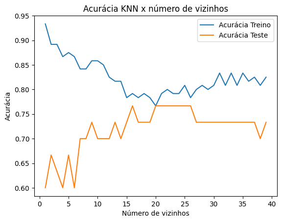

🚀 **Supervised Learning with Scikit-Learn - DataCamp** 🚀

Este repositório é dedicado a anotações e testes de código do curso "Supervised Learning with Scikit-Learn" do DataCamp. Embora a maior parte do código seja executada diretamente na plataforma do DataCamp, optei por testar alguns conceitos localmente para aprofundar meu entendimento.

📊 **O curso aborda**:
- **Criação de Modelos Preditivos**: Desenvolvimento de modelos para prever se um cliente irá deixar um serviço, identificar se um indivíduo tem diabetes e até classificar o gênero de uma música. O curso também cobre a criação de Pipelines utilizando o scikit-learn para normalização de dados e transformação com imputadores.
- **Otimização e Avaliação**: O curso detalha a aplicação de validação cruzada e o ajuste de parâmetros dos modelos utilizando técnicas de GridSearch e RandomSearch para fine-tuning.

**Discussões Interessantes:**

- **Intuição sobre o ajuste do parâmetro `n_neighbors` no modelo k-nearest neighbors (KNN)**:

  O parâmetro `n_neighbors` define o número de vizinhos considerados ao classificar um novo ponto de dados. Um valor maior pode aumentar a complexidade do modelo e, enquanto pode melhorar a performance, também pode levar ao overfitting. A imagem abaixo ilustra a acurácia para diferentes números de vizinhos em um modelo de classificação treinado e testado com o dataset Iris do scikit-learn.

  

- **Uso do Mean Squared Error Negativo na Validação Cruzada**:

  Na validação cruzada, as métricas de avaliação geralmente são otimizadas para maximização, como a acurácia. No entanto, quando trabalhamos com métricas que devem ser minimizadas, como o Mean Squared Error (MSE), é necessário ajustar a abordagem. Para isso, utilizamos o MSE negativo.

  O MSE é uma métrica que queremos minimizar (quanto menor, melhor). No entanto, o padrão do `cross_val_score` é maximizar a métrica fornecida. Portanto, ao usar o MSE, você deve fornecer o MSE negativo como a métrica para maximização. Dessa forma, maximizar o MSE negativo é equivalente a minimizar o MSE.

  O exemplo abaixo mostra como realizar a validação cruzada com MSE negativo:

  ```python
  from sklearn.linear_model import Ridge
  from sklearn.model_selection import cross_val_score
  import numpy as np

  # Criação de X e y
  X = music_dummies.drop('popularity', axis=1).values
  y = music_dummies['popularity'].values

  # Instanciação do modelo Ridge
  ridge = Ridge(alpha=0.2)

  # Realização da validação cruzada com MSE negativo
  scores = cross_val_score(ridge, X, y, cv=kf, scoring="neg_mean_squared_error")

  # Cálculo do RMSE
  rmse = np.sqrt(-scores)
  print("RMSE Médio: {}".format(np.mean(rmse)))
  print("Desvio Padrão do Array de Target: {}".format(np.std(y)))
